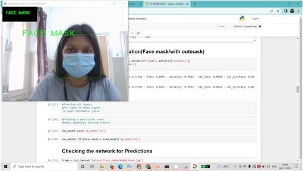

# Face Mask Detector

## Project Overview
The *Face Mask Detector* is a real-time computer vision project that identifies whether a person is wearing a face mask using deep learning and video processing techniques. By leveraging transfer learning on a pre-trained model, this system can classify faces as either "mask" or "no mask" with high accuracy.

### Key Features
- *Real-time mask detection* via webcam input
- *TensorFlow object detection API* for enhanced performance
- *SSD MobileNetV2 320x320* pre-trained model for transfer learning
- *97.07% accuracy* on real-time video streams
- Provides visual feedback using bounding boxes and text
  

### Technical Highlights
- *Frameworks:* TensorFlow and OpenCV for deep learning and image processing
- *Optimizer and Loss:* Adam optimizer and binary cross-entropy loss function
- *Dataset:* Trained on 1,878 images
- *Face Detection:* Uses Haar Cascade Classifier for initial face localization
- *Interface:* User-friendly, real-time mask detection feedback

## Prerequisites

### Required Skills and Knowledge:
- *Python Programming:* Understanding of Python syntax, file operations, and debugging.
- *Machine Learning & Deep Learning:* Experience with CNNs, transfer learning, and model evaluation metrics.
- *Computer Vision:* Familiarity with image representation, object detection, and face detection using OpenCV.
- *TensorFlow & Keras:* Expertise in using TensorFlow for model architecture, training, and fine-tuning.
- *OpenCV:* Skill in real-time video capture and image preprocessing.
- *Data Handling:* Knowledge of dataset creation, augmentation, and serialization.

## Project Workflow

1. *Dataset Preparation and Augmentation*
   - Use a custom dataset with various face mask images.
   
2. *Transfer Learning using SSD MobileNetV2*
   - Fine-tune the pre-trained model on the custom dataset.

3. *Model Training & Optimization*
   - Optimize using Adam optimizer and binary cross-entropy loss.
   
4. *Real-time Video Processing Integration*
   - Use OpenCV to integrate live video streaming for mask detection.
   
5. *User Interface Implementation*
   - Provide visual feedback on mask status using bounding boxes and labels.

## Performance Evaluation
The project’s high accuracy rate of *97.07%* reflects the model's effectiveness in real-world applications. However, further improvements can be made by expanding the dataset and optimizing the model for various environments and conditions.
